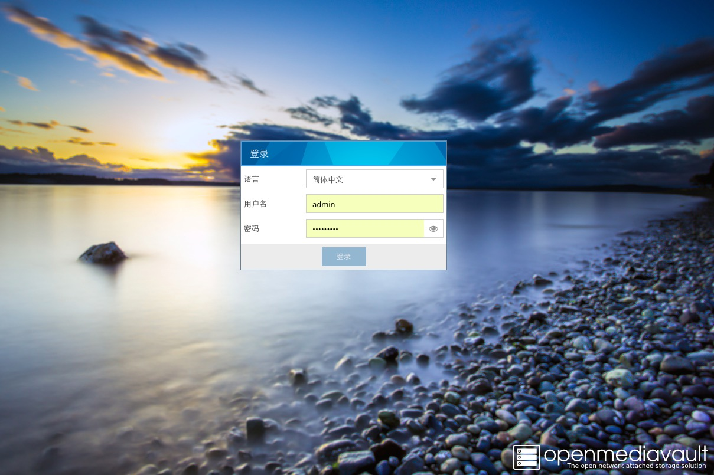
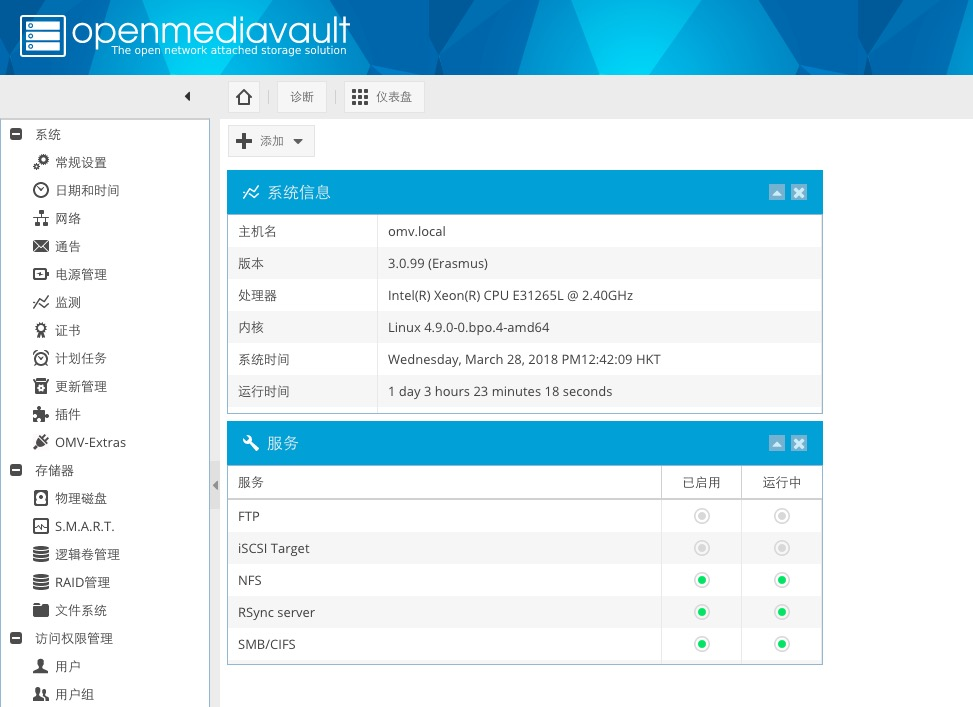

>This is a omv4.x's theme with blue style.

## install guide ##

1. clone or download the code to your OMV. `git clone https://github.com/ivanhao/omv4.x-themes-blue.git`
2. cd to the path
3. execute the `chmod +x ./*.sh` command to make it have right permission to execute the install or uninstall.
4. `./install.sh` to install theme.
> Don't forget to refresh web browser's caches.

## uninstall guide ##
`./uninstall.sh` to uninstall theme.

***

>这是一个omv4.x的蓝色主题 我是QQ群的龙天，用了觉得好的麻烦给点个右上角小星星

## 安装说明 ##

1. clone或下载安装包到omv里，例如在/root目录运行：`git clone https://github.com/ivanhao/omv4.x-themes-blue.git`。
2. 命令行cd到安装包的路径里。
3. 执行`chmod +x ./*.sh`来让程序有执行的权限。
4. `./install.sh`来安装，根据提示很快就完成了。然后刷新界面。
> 不要忘记清理浏览器的缓存。

## 卸载 ##

`./uninstall.sh` 来卸载。

